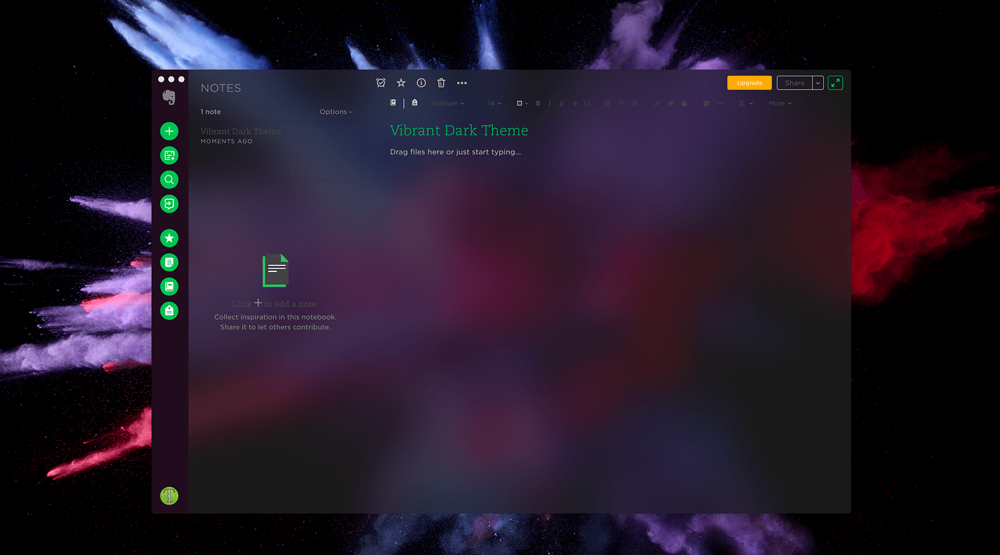

<h1 align="center">
   Tusk
</h1>

<h4 align="center">
  🐘 Refined Evernote desktop app
</h4>

      

  
  
  

## Description

Tusk is an unofficial, featureful, open source, community-driven, free Evernote app used by people in more than [130 countries](https://snapcraft.io/tusk).

Come over to [Gitter](https://gitter.im/klauscfhq/tusk) or [Twitter](https://twitter.com/klauscfhq) to share your thoughts on the project.

You can find more desktop apps [here](#related-apps).

## Highlights

- [Black](#black-theme), [Dark](#dark-theme), [Sepia](#sepia-theme) & [Vibrant](#vibrant-themes) Themes
- [Focus](#focus-mode), [Compact](#compact-mode) & [Auto-Night](#auto-night-mode) Modes
- [Local](#local-shortcut-keys) & [Global](#global-shortcut-keys) Keyboard Shortcuts
- [Customizable Keyboard Shortcuts](#custom-shortcut-keys)
- Export Notes as [PDF](#export-notes-as-pdf) & [Markdown](#export-notes-as-markdown) files
- [Note Printing](#note-printing)
- [Scalable Interface](#scalable-interface)
- [Note Navigation](#note-navigation)
- [Yinxiang Support](#yinxiang-support)
- Cross Platform
- Automatic Updates 🐘
- RTL Support
- Deep OS Integration
- Drag and Drop Files

🐘 Windows & Linux only atm

## Contents

- [Description](#description)
- [Highlights](#highlights)
- [Install](#install)
- [Features](#features)
- [Keyboard Shortcuts](#keyboard-shortcuts)
- [Development](#development)
- [Related Apps](#related-apps)
- [Team](#team)
- [Disclaimer](#disclaimer)
- [License](#license)

## Install

#### Github Releases

Head to the [releases](https://github.com/klauscfhq/tusk/releases/latest) page and download the appropriate installer for your system.

#### Snap

Ubuntu Linux users can directly install through [Snap](https://snapcraft.io/tusk) `snap install tusk`

#### Homebrew

Macos users can directly install through [Homebrew Cask](https://caskroom.github.io/) `brew cask install tusk`

#### AUR

Arch Linux users can directly install through [AUR](https://aur.archlinux.org/packages/tusk/) `yaourt tusk`

#### Note

The version available on `Homebrew Cask` or `AUR` may not be the latest. If that is the case, please consider downloading directly from the [Github releases](https://github.com/klauscfhq/tusk/releases/latest) page.

## Features

### Vibrant Themes

Press <kbd>Cmd</kbd> <kbd>Alt</kbd> <kbd>U</kbd> / <kbd>Cmd</kbd> <kbd>Alt</kbd> <kbd>J</kbd> to activate the [dark](https://cdn.rawgit.com/klauscfhq/tusk/33f2eae5/media/vibrant-dark-theme.png) or [light](https://cdn.rawgit.com/klauscfhq/tusk/33f2eae5/media/vibrant-light-theme.png) vibrant theme respectively.

Please note that the feature is available [**only on Macos**](https://github.com/klauscfhq/tusk/issues/19).

      

### Sepia Theme

Perfect for glossy screens. Activate it by pressing <kbd>Cmd/Ctrl</kbd> <kbd>G</kbd>

      

### Dark Theme

Silky & relaxing. Make it yours by pressing <kbd>Cmd/Ctrl</kbd> <kbd>D</kbd>

      

### Black Theme

Deep focus materialized. Boost your productivity by pressing <kbd>Cmd/Ctrl</kbd> <kbd>Alt</kbd> <kbd>E</kbd>

      

### Focus Mode

Press <kbd>Cmd/Ctrl</kbd> <kbd>K</kbd> and immerse yourself in a distraction-free note-taking mode.

      

### Compact Mode

Get more for less. Keep your productivity to the maximum no matter the screen size. Simply downsize the window to enter the mode.

      

### Note Navigation

Navigate seamlessly between your notes by pressing <kbd>Cmd/Ctrl</kbd> <kbd>Tab</kbd> / <kbd>Cmd/Ctrl</kbd> <kbd>Shift</kbd> <kbd>Tab</kbd> or jump directly to a specific note by using <kbd>Cmd/Ctrl</kbd> <kbd>1</kbd> - <kbd>9</kbd>

      

### Note Printing

Printing your notes is only a keystroke away. Press <kbd>Cmd/Ctrl</kbd> <kbd>Alt</kbd> <kbd>P</kbd> and transfer them from screen to paper.

      

### Custom Shortcut Keys

Adjust Tusk to your workflow. Navigate to `~/.tusk.json` or press <kbd>Cmd/Ctrl</kbd> <kbd>.</kbd> and modify any shortcut key to your own preference. To reset simply delete the tusk config file from your home directory.

      

### Scalable Interface

Adjust the zooming factor to your own preference by pressing <kbd>Cmd/Ctrl</kbd> <kbd>Shift</kbd> <kbd>=</kbd> or <kbd>Cmd/Ctrl</kbd> <kbd>-</kbd>

      

### Export Notes as PDF

Press <kbd>Cmd/Ctrl</kbd> <kbd>Shift</kbd> <kbd>E</kbd> and save your notes effortlessly on your machine as `pdf` files.

      

### Yinxiang Support

Login with your Yinxiang account by using the `File` > `Switch to Yinxiang` option.

      

### Auto Night Mode

Press <kbd>Cmd/Ctrl</kbd> <kbd>Alt</kbd> <kbd>N</kbd> and allow Tusk to intelligently adjust to your environment.

### Export Notes as Markdown

Press <kbd>Cmd/Ctrl</kbd> <kbd>O</kbd> and instantly export your notes as `markdown` files.

## Keyboard Shortcuts

### Local Shortcut Keys

70+ local keyboard shortcuts. Toggle anything in a flash.

View all the available local keyboard shortcuts.

 

Description                | Keys
-------------------------- | --------------------------
Toggle Window Menu         | <kbd>Alt</kbd>
Toggle Full Screen         | <kbd>F11</kbd>
Return to Notes            | <kbd>Esc</kbd>
Delete Note                | <kbd>Delete</kbd>
Toggle Dark Theme          | <kbd>Cmd/Ctrl</kbd> <kbd>D</kbd>
Toggle Sepia Theme         | <kbd>Cmd/Ctrl</kbd> <kbd>G</kbd>
Toggle Focus Mode          | <kbd>Cmd/Ctrl</kbd> <kbd>K</kbd>
New Note                   | <kbd>Cmd/Ctrl</kbd> <kbd>N</kbd>
Save Note                  | <kbd>Cmd/Ctrl</kbd> <kbd>S</kbd>
Set Reminder               | <kbd>Cmd/Ctrl</kbd> <kbd>E</kbd>
Search Notes               | <kbd>Cmd/Ctrl</kbd> <kbd>F</kbd>
Bold Text                  | <kbd>Cmd/Ctrl</kbd> <kbd>B</kbd>
Italic Text                | <kbd>Cmd/Ctrl</kbd> <kbd>I</kbd>
Underline Text             | <kbd>Cmd/Ctrl</kbd> <kbd>U</kbd>
Strikethrough Text         | <kbd>Cmd/Ctrl</kbd> <kbd>T</kbd>
Export Note as Markdown    | <kbd>Cmd/Ctrl</kbd> <kbd>O</kbd>
Insert Date-Time Stamp     | <kbd>Cmd/Ctrl</kbd> <kbd>;</kbd>
Toggle Settings            | <kbd>Cmd/Ctrl</kbd> <kbd>,</kbd>
Make Text Smaller          | <kbd>Cmd/Ctrl</kbd> <kbd>-</kbd>
Edit Shortcut Keys         | <kbd>Cmd/Ctrl</kbd> <kbd>.</kbd>
Reset Zoom Level           | <kbd>Cmd/Ctrl</kbd> <kbd>0</kbd>
Toggle Sidebar             | <kbd>Cmd/Ctrl</kbd> <kbd>\\</kbd>
Navigate to Next Note      | <kbd>Cmd/Ctrl</kbd> <kbd>Tab</kbd>
Toggle Tags                | <kbd>Alt</kbd> <kbd>Shift</kbd> <kbd>T</kbd>
Toggle Notebooks           | <kbd>Alt</kbd> <kbd>Shift</kbd> <kbd>N</kbd>
Jump to Note               | <kbd>Cmd/Ctrl</kbd> <kbd>1</kbd> - <kbd>9</kbd>
Change Font Size           | <kbd>Cmd/Ctrl</kbd> <kbd>Alt</kbd> <kbd>1</kbd> - <kbd>6</kbd>
Toggle Black Theme         | <kbd>Cmd/Ctrl</kbd> <kbd>Alt</kbd> <kbd>E</kbd>
Toggle Vibrant Light Theme | <kbd>Cmd/Ctrl</kbd> <kbd>Alt</kbd> <kbd>U</kbd>
Toggle Vibrant Dark Theme  | <kbd>Cmd/Ctrl</kbd> <kbd>Alt</kbd> <kbd>J</kbd>
Print Note                 | <kbd>Cmd/Ctrl</kbd> <kbd>Alt</kbd> <kbd>P</kbd>
Add Shortcut               | <kbd>Cmd/Ctrl</kbd> <kbd>Alt</kbd> <kbd>S</kbd>
Align Left                 | <kbd>Cmd/Ctrl</kbd> <kbd>Alt</kbd> <kbd>L</kbd>
Align Center               | <kbd>Cmd/Ctrl</kbd> <kbd>Alt</kbd> <kbd>M</kbd>
Align Right                | <kbd>Cmd/Ctrl</kbd> <kbd>Alt</kbd> <kbd>R</kbd>
Increase Indentation       | <kbd>Cmd/Ctrl</kbd> <kbd>Alt</kbd> <kbd>K</kbd>
Activate Auto Night Mode   | <kbd>Cmd/Ctrl</kbd> <kbd>Alt</kbd> <kbd>N</kbd>
Make Text Larger           | <kbd>Cmd/Ctrl</kbd> <kbd>Shift</kbd> <kbd>=</kbd>
Export Note as PDF         | <kbd>Cmd/Ctrl</kbd> <kbd>Shift</kbd> <kbd>E</kbd>
New Tag                    | <kbd>Cmd/Ctrl</kbd> <kbd>Shift</kbd> <kbd>T</kbd>
New Notebook               | <kbd>Cmd/Ctrl</kbd> <kbd>Shift</kbd> <kbd>N</kbd>
Toggle Checkbox            | <kbd>Cmd/Ctrl</kbd> <kbd>Shift</kbd> <kbd>B</kbd>
Code Block                 | <kbd>Cmd/Ctrl</kbd> <kbd>Shift</kbd> <kbd>L</kbd>
Add Link                   | <kbd>Cmd/Ctrl</kbd> <kbd>Shift</kbd> <kbd>K</kbd>
Attach File                | <kbd>Cmd/Ctrl</kbd> <kbd>Shift</kbd> <kbd>F</kbd>
Insert from Drive          | <kbd>Cmd/Ctrl</kbd> <kbd>Shift</kbd> <kbd>D</kbd>
Decrease Indentation       | <kbd>Cmd/Ctrl</kbd> <kbd>Shift</kbd> <kbd>M</kbd>
Numbered List              | <kbd>Cmd/Ctrl</kbd> <kbd>Shift</kbd> <kbd>O</kbd>
Toggle Shortcuts           | <kbd>Cmd/Ctrl</kbd> <kbd>Shift</kbd> <kbd>S</kbd>
Toggle Dev Tools           | <kbd>Cmd/Ctrl</kbd> <kbd>Shift</kbd> <kbd>I</kbd>
Reload Tusk                | <kbd>Cmd/Ctrl</kbd> <kbd>Shift</kbd> <kbd>R</kbd>
Set Always on Top          | <kbd>Cmd/Ctrl</kbd> <kbd>Shift</kbd> <kbd>P</kbd>
Insert Date Stamp          | <kbd>Cmd/Ctrl</kbd> <kbd>Shift</kbd> <kbd>;</kbd>
Bulleted List              | <kbd>Cmd/Ctrl</kbd> <kbd>Shift</kbd> <kbd>.</kbd>
Subscript Text             | <kbd>Cmd/Ctrl</kbd> <kbd>Shift</kbd> <kbd>]</kbd>
Superscript Text           | <kbd>Cmd/Ctrl</kbd> <kbd>Shift</kbd> <kbd>[</kbd>
Insert Horizontal Rule     | <kbd>Cmd/Ctrl</kbd> <kbd>Shift</kbd> <kbd>-</kbd>
Navigate to Previews Note  | <kbd>Cmd/Ctrl</kbd> <kbd>Shift</kbd> <kbd>Tab</kbd>
Remove Formatting          | <kbd>Cmd/Ctrl</kbd> <kbd>Shift</kbd> <kbd>Space</kbd>

 

### Global Shortcut Keys

Access Tusk at any moment from anywhere within your operating system. All global shortcuts can be customized to match your own preference through the configuration file `~/.tusk.json`.

View all the available global keyboard shortcuts.

 

Description                | Global Shortcut
-------------------------- | --------------------------
Toggle Tusk Window         | <kbd>Alt</kbd> <kbd>Shift</kbd> <kbd>A</kbd>
Create New Note            | <kbd>Alt</kbd> <kbd>Shift</kbd> <kbd>C</kbd>
Search Notes               | <kbd>Alt</kbd> <kbd>Shift</kbd> <kbd>F</kbd>

 

## Development

For more info on how to contribute to the project, please read the [contributing guidelines](https://github.com/klauscfhq/tusk/blob/master/contributing.md).

- Fork the repository and clone it to your machine
- Navigate to your local fork: `cd tusk`
- Install the project dependencies: `npm install` or `yarn install`
- Run Tusk on dev mode: `npm start` or `yarn start`
- Lint code for errors: `npm test` or `yarn test`
- Build binaries and installers: `npm run dist` or `yarn dist`

## Related Apps

- [Ao](https://github.com/klauscfhq/ao) - Elegant Microsoft To-Do desktop app.

## Team

Coded with ❤ by

- Klaus Sinani [(@klauscfhq)](https://github.com/klauscfhq)
- Mario Sinani [(@mariocfhq)](https://github.com/mariocfhq)
- Thanasis Gkanos [(@ThanasisGkanos)](https://github.com/ThanasisGkanos)

## Disclaimer

Tusk is an unofficial, open source, third-party, community-driven, free app and is not affiliated in any way with Evernote.

## License

[MIT](https://github.com/klauscfhq/tusk/blob/master/license.md)
