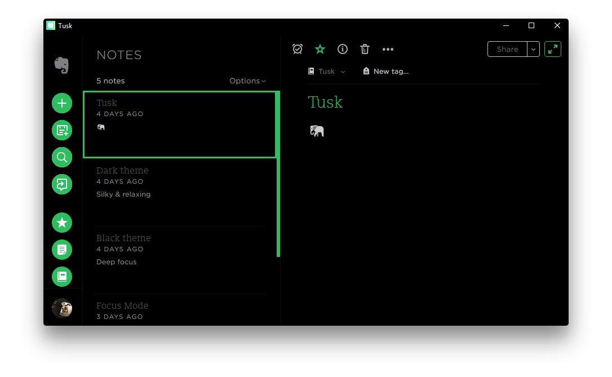

<h1 align="center">
   Tusk
</h1>

<h4 align="center">
  Refined Evernote desktop app
</h4>

  

  

## Description

Tusk is an unofficial, featureful, open source, community-driven, free Evernote app used by people in more than [140 countries](https://snapcraft.io/tusk).

Tusk is [indicated by Evernote](https://help.evernote.com/hc/en-us/articles/208313748-Evernote-on-Linux) as an alternative client for Linux environments trusted by the open source community.

You can now support the development process through [GitHub Sponsors](https://github.com/sponsors/klaussinani).

Come over to [Gitter](https://gitter.im/klaussinani/tusk) or [Twitter](https://twitter.com/klaussinani) to share your thoughts on the project.

Visit the [contributing guidelines](https://github.com/klaussinani/tusk/blob/master/contributing.md#translating-documentation) to learn more on how to translate this document into more languages.

You can find more apps [here](#related-apps).

## Highlights

- Black, Dark & Sepia Themes
- Focus, Compact & Auto-Night Modes
- Local & Global Customizable Keyboard Shortcuts
- Export Notes as PDF, HTML & Markdown Files
- Note Navigation
- Yinxiang Support
- Cross Platform
- Scalable Interface
- Update Notifications
- Drag and Drop Files

## Contents

- [Description](#description)
- [Highlights](#highlights)
- [Install](#install)
- [Features](#features)
- [Keyboard Shortcuts](#keyboard-shortcuts)
- [Development](#development)
- [Related Apps](#related-apps)
- [Team](#team)
- [Disclaimer](#disclaimer)
- [License](#license)

## Install

#### Github Releases

Head to the [releases](https://github.com/klaussinani/tusk/releases/latest) page and download the appropriate installer for your system.

#### Snapcraft

Ubuntu Linux users can directly install through [Snapcraft](https://snapcraft.io/tusk) `snap install tusk`

#### Homebrew

Macos users can directly install through [Homebrew Cask](https://caskroom.github.io/) `brew cask install tusk`

#### Note

The version available on `Homebrew Cask` may not be the latest, since unlike `Snapcraft`, it is not offically maintained. If that is the case, please consider downloading directly from the [Github releases](https://github.com/klaussinani/tusk/releases/latest) page.

## Features

Visit the project [homepage](https://klaussinani.github.io/tusk) to view all features in detail.

- Auto Night Mode - Press <kbd>Cmd/Ctrl</kbd> <kbd>Alt</kbd> <kbd>N</kbd> to allow Tusk to adjust to your environment.
- Black Theme - Activate it by pressing <kbd>Cmd/Ctrl</kbd> <kbd>Alt</kbd> <kbd>E</kbd>.
- Compact Mode - Downsize the window to enter the mode.
- Custom Shortcut Keys - Navigate to `~/.tusk.json` or press <kbd>Cmd/Ctrl</kbd> <kbd>.</kbd> to modify any shortcut key. To reset delete `~/.tusk.json` & restart the app.
- Dark Theme - Activate it by pressing <kbd>Cmd/Ctrl</kbd> <kbd>D</kbd>.
- Drag & Drop Files - Attach files by dragging them to the app window.
- Export Notes as Markdown - Press <kbd>Cmd/Ctrl</kbd> <kbd>O</kbd> to save your notes as `Markdown` files.
- Export Notes as HTML - Press <kbd>Cmd/Ctrl</kbd> <kbd>Shift</kbd> <kbd>H</kbd> to save your notes as `HTML` files.
- Export Notes as PDF - Press <kbd>Cmd/Ctrl</kbd> <kbd>Shift</kbd> <kbd>E</kbd> to save your notes as `PDF` files.
- Focus Mode - Activate it by pressing <kbd>Cmd/Ctrl</kbd> <kbd>K</kbd>.
- Global Shortcut Keys - Enable them by using the `File` > `Enable Global Shortcut Keys` option.
- Note Navigation - Navigate your notes by pressing <kbd>Cmd/Ctrl</kbd> <kbd>Tab</kbd> / <kbd>Cmd/Ctrl</kbd> <kbd>Shift</kbd> <kbd>Tab</kbd> or jump directly to one by using <kbd>Cmd/Ctrl</kbd> <kbd>1</kbd> - <kbd>9</kbd>.
- Note Printing - Press <kbd>Cmd/Ctrl</kbd> <kbd>Alt</kbd> <kbd>P</kbd> to print your notes.
- Scalable Interface - Adjust the zooming factor by pressing <kbd>Cmd/Ctrl</kbd> <kbd>Shift</kbd> <kbd>=</kbd> or <kbd>Cmd/Ctrl</kbd> <kbd>-</kbd>.
- Sepia Theme - Activate it by pressing <kbd>Cmd/Ctrl</kbd> <kbd>G</kbd>.
- Update Notifications - Customize the apps update checking frequency.
- Yinxiang Support - Login to Yinxiang by using the `File` > `Switch to Yinxiang` option.

## Keyboard Shortcuts

### Local Shortcut Keys

70+ local keyboard shortcuts. Toggle anything in a flash.

View all the available local keyboard shortcuts.

 

Description                | Keys
-------------------------- | --------------------------
Activate Auto Night Mode   | <kbd>Cmd/Ctrl</kbd> <kbd>Alt</kbd> <kbd>N</kbd>
Add Link                   | <kbd>Cmd/Ctrl</kbd> <kbd>Shift</kbd> <kbd>K</kbd>
Add Shortcut               | <kbd>Cmd/Ctrl</kbd> <kbd>Alt</kbd> <kbd>S</kbd>
Align Center               | <kbd>Cmd/Ctrl</kbd> <kbd>Alt</kbd> <kbd>M</kbd>
Align Left                 | <kbd>Cmd/Ctrl</kbd> <kbd>Alt</kbd> <kbd>L</kbd>
Align Right                | <kbd>Cmd/Ctrl</kbd> <kbd>Alt</kbd> <kbd>R</kbd>
Attach File                | <kbd>Cmd/Ctrl</kbd> <kbd>Shift</kbd> <kbd>F</kbd>
Bold Text                  | <kbd>Cmd/Ctrl</kbd> <kbd>B</kbd>
Bulleted List              | <kbd>Cmd/Ctrl</kbd> <kbd>Shift</kbd> <kbd>.</kbd>
Change Font Size           | <kbd>Cmd/Ctrl</kbd> <kbd>Alt</kbd> <kbd>1</kbd> - <kbd>6</kbd>
Code Block                 | <kbd>Cmd/Ctrl</kbd> <kbd>Shift</kbd> <kbd>L</kbd>
Decrease Indentation       | <kbd>Cmd/Ctrl</kbd> <kbd>Shift</kbd> <kbd>M</kbd>
Delete Note                | <kbd>Delete</kbd>
Edit Shortcut Keys         | <kbd>Cmd/Ctrl</kbd> <kbd>.</kbd>
Export Note as HTML         | <kbd>Cmd/Ctrl</kbd> <kbd>Shift</kbd> <kbd>H</kbd>
Export Note as Markdown    | <kbd>Cmd/Ctrl</kbd> <kbd>O</kbd>
Export Note as PDF         | <kbd>Cmd/Ctrl</kbd> <kbd>Shift</kbd> <kbd>E</kbd>
Increase Indentation       | <kbd>Cmd/Ctrl</kbd> <kbd>Alt</kbd> <kbd>K</kbd>
Insert Date Stamp          | <kbd>Cmd/Ctrl</kbd> <kbd>Shift</kbd> <kbd>;</kbd>
Insert Date-Time Stamp     | <kbd>Cmd/Ctrl</kbd> <kbd>;</kbd>
Insert from Drive          | <kbd>Cmd/Ctrl</kbd> <kbd>Shift</kbd> <kbd>D</kbd>
Insert Horizontal Rule     | <kbd>Cmd/Ctrl</kbd> <kbd>Shift</kbd> <kbd>-</kbd>
Italic Text                | <kbd>Cmd/Ctrl</kbd> <kbd>I</kbd>
Jump to Note               | <kbd>Cmd/Ctrl</kbd> <kbd>1</kbd> - <kbd>9</kbd>
Make Text Larger           | <kbd>Cmd/Ctrl</kbd> <kbd>Shift</kbd> <kbd>=</kbd>
Make Text Smaller          | <kbd>Cmd/Ctrl</kbd> <kbd>-</kbd>
Navigate to Next Note      | <kbd>Cmd/Ctrl</kbd> <kbd>Tab</kbd>
Navigate to Previews Note  | <kbd>Cmd/Ctrl</kbd> <kbd>Shift</kbd> <kbd>Tab</kbd>
New Note                   | <kbd>Cmd/Ctrl</kbd> <kbd>N</kbd>
New Notebook               | <kbd>Cmd/Ctrl</kbd> <kbd>Shift</kbd> <kbd>N</kbd>
New Tag                    | <kbd>Cmd/Ctrl</kbd> <kbd>Shift</kbd> <kbd>T</kbd>
Numbered List              | <kbd>Cmd/Ctrl</kbd> <kbd>Shift</kbd> <kbd>O</kbd>
Print Note                 | <kbd>Cmd/Ctrl</kbd> <kbd>Alt</kbd> <kbd>P</kbd>
Remove Formatting          | <kbd>Cmd/Ctrl</kbd> <kbd>Shift</kbd> <kbd>Space</kbd>
Reset Zoom Level           | <kbd>Cmd/Ctrl</kbd> <kbd>0</kbd>
Return to Notes            | <kbd>Esc</kbd>
Save Note                  | <kbd>Cmd/Ctrl</kbd> <kbd>S</kbd>
Search Notes               | <kbd>Cmd/Ctrl</kbd> <kbd>F</kbd>
Set Always on Top          | <kbd>Cmd/Ctrl</kbd> <kbd>Shift</kbd> <kbd>P</kbd>
Set Reminder               | <kbd>Cmd/Ctrl</kbd> <kbd>E</kbd>
Strikethrough Text         | <kbd>Cmd/Ctrl</kbd> <kbd>T</kbd>
Subscript Text             | <kbd>Cmd/Ctrl</kbd> <kbd>Shift</kbd> <kbd>]</kbd>
Superscript Text           | <kbd>Cmd/Ctrl</kbd> <kbd>Shift</kbd> <kbd>[</kbd>
Toggle Black Theme         | <kbd>Cmd/Ctrl</kbd> <kbd>Alt</kbd> <kbd>E</kbd>
Toggle Checkbox            | <kbd>Cmd/Ctrl</kbd> <kbd>Shift</kbd> <kbd>B</kbd>
Toggle Dark Theme          | <kbd>Cmd/Ctrl</kbd> <kbd>D</kbd>
Toggle Focus Mode          | <kbd>Cmd/Ctrl</kbd> <kbd>K</kbd>
Toggle Notebooks           | <kbd>Alt</kbd> <kbd>Shift</kbd> <kbd>N</kbd>
Toggle Sepia Theme         | <kbd>Cmd/Ctrl</kbd> <kbd>G</kbd>
Toggle Settings            | <kbd>Cmd/Ctrl</kbd> <kbd>,</kbd>
Toggle Shortcuts           | <kbd>Cmd/Ctrl</kbd> <kbd>Shift</kbd> <kbd>S</kbd>
Toggle Sidebar             | <kbd>Cmd/Ctrl</kbd> <kbd>\\</kbd>
Toggle Tags                | <kbd>Alt</kbd> <kbd>Shift</kbd> <kbd>T</kbd>
Toggle Window Menu         | <kbd>Alt</kbd>
Underline Text             | <kbd>Cmd/Ctrl</kbd> <kbd>U</kbd>

 

### Global Shortcut Keys

Access Tusk at any moment from anywhere within your operating system. All global shortcuts can be customized to match your own preference through the configuration file `~/.tusk.json`.

View all the available global keyboard shortcuts.

 

Description                | Global Shortcut
-------------------------- | --------------------------
Toggle Tusk Window         | <kbd>Cmd/Ctrl</kbd> <kbd>Alt</kbd> <kbd>A</kbd>
Create New Note            | <kbd>Cmd/Ctrl</kbd> <kbd>Alt</kbd> <kbd>C</kbd>
Search Notes               | <kbd>Cmd/Ctrl</kbd> <kbd>Alt</kbd> <kbd>F</kbd>

 

## Development

For more info on how to contribute to the project, please read the [contributing guidelines](https://github.com/klaussinani/tusk/blob/master/contributing.md).

- Fork the repository and clone it to your machine
- Navigate to your local fork: `cd tusk`
- Install the project dependencies: `npm install` or `yarn install`
- Run Tusk on dev mode: `npm start` or `yarn start`
- Lint code for errors: `npm test` or `yarn test`
- Build binaries and installers: `npm run release` or `yarn release`

## Related Apps

- [Ao](https://github.com/klaussinani/ao) - Elegant Microsoft To-Do desktop app.
- [Taskbook](https://github.com/klaussinani/taskbook) - Tasks, boards & notes for the command-line habitat.

## Team

- Klaus Sinani [(@klaussinani)](https://github.com/klaussinani)
- Mario Sinani [(@mariosinani)](https://github.com/mariosinani)
- Thanasis Gkanos [(@ThanasisGkanos)](https://github.com/ThanasisGkanos)

## Disclaimer

Tusk is an unofficial, open source, third-party, community-driven, free app and is not affiliated in any way with Evernote.

## License

[MIT](https://github.com/klaussinani/tusk/blob/master/license.md)
